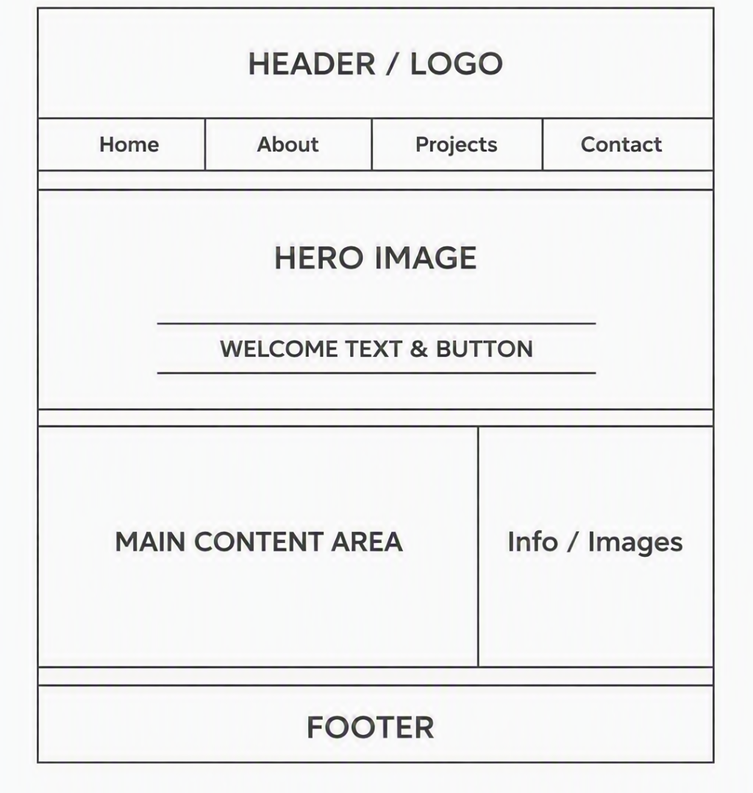

# 🌿 GreenFutureWebsite
**Student:** Akani Sithole (ST10503321)  
**Module:** WEDE5020 – Web Development (Introduction)  
**Institution:** Rosebank College  

---

## 🌍 Project Overview
GreenFutureWebsite is a responsive website promoting environmental awareness and community action. It showcases projects such as clean‑ups, tree planting, and sustainable agriculture initiatives across Mpumalanga.

---

## 🎯 Goals and Objectives
- Educate communities on sustainability and eco‑friendly practices  
- Encourage participation in clean‑up and tree‑planting events  
- Provide a platform for schools and organizations to share green projects  
- Inspire youth involvement in environmental conservation  

---

## ⚙️ Features
- Home page with mission statement and hero image  
- About page introducing GreenFuture’s vision and team  
- Projects page highlighting community and school initiatives  
- Enquiry form for volunteers and sponsors (with validation)  
- Contact page with location, Google Maps embed, and communication details  

---

## 🗓️ Timeline
| Week | Task | Status |
|------|------|--------|
| 1 | Project proposal & setup | ✅ Complete |
| 2 | HTML structure & navigation | ✅ Complete |
| 3 | CSS styling & layout | ✅ Complete |
| 4 | JS functionality & testing | ✅ Complete |

---

## 🧭 Sitemap

---

## 🧩 Wireframes

---

## 🧱 File and Folder Structure
GreenFutureWebsite/
│
├── css/
│   └── style.css
├── js/
│   └── script.js
├── GreenFuture_Content/
│   ├── documents/
│   │   ├── sitemap.png
│   │   └── wireframe.png
│   ├── images/
│   │   ├── cleanup.jpg
│   │   ├── hero.jpg
│   │   ├── logo.webp
│   │   ├── school.jpg
│   │   └── treeplanting.webp
│   └── text/
├── about.html
├── contact.html
├── enquiry.html
├── index.html
├── projects.html
└── README.md

Code

---

## 🔄 Changelog
- **v1.0** – Initial commit with index.html  
- **v1.1** – Added About and Projects pages  
- **v1.2** – Added Enquiry and Contact pages  
- **v1.3** – Linked CSS and JS files  
- **v1.4** – Added images and content folders  
- **v1.5** – Updated README with sitemap and wireframes  
- **v1.6** – Polished CSS with green theme, hover effects, and card styling  
- **v1.7** – Added responsive design (tablet & mobile breakpoints)  

---

## 📚 References
- W3Schools. (2026). *HTML, CSS, and JavaScript Tutorials*. Retrieved from https://www.w3schools.com  
- Mpumalanga Green Cluster Agency. (2026). *Sustainable Agri Movement*. Retrieved from https://www.mgca.org.za  
- The Independent Institute of Education. (2026). *Web Development (Introduction) Module Guide*. Rosebank College  
-📚 Final Submission References
🔧 Technical Sources
W3Schools. (2026). HTML, CSS, and JavaScript Tutorials. Retrieved from https://www.w3schools.com

Mozilla Developer Network (MDN). (2026). Web Docs: HTML, CSS, JavaScript. Retrieved from https://developer.mozilla.org

FreeCodeCamp. (2026). Responsive Web Design Principles. Retrieved from https://www.freecodecamp.org

Google Developers. (2026). SEO Starter Guide. Retrieved from https://developers.google.com/search/docs/fundamentals/seo-starter-guide (developers.google.com in Bing)

🌍 Contextual Sources
Mpumalanga Green Cluster Agency. (2026). Sustainable Agri Movement. Retrieved from https://www.mgca.org.za

The Independent Institute of Education. (2026). Web Development (Introduction) Module Guide. Rosebank College.
---

## 📸 Responsive Design Evidence
- Screenshot: Desktop view  
- Screenshot: Tablet view  
- Screenshot: Mobile view  

*(Screenshots added after testing in browser developer tools.)*

---

## 👨‍💻 Author
**Akani Sithole (ST10503321)**  
GreenFutureWebsite – WEDE5020 